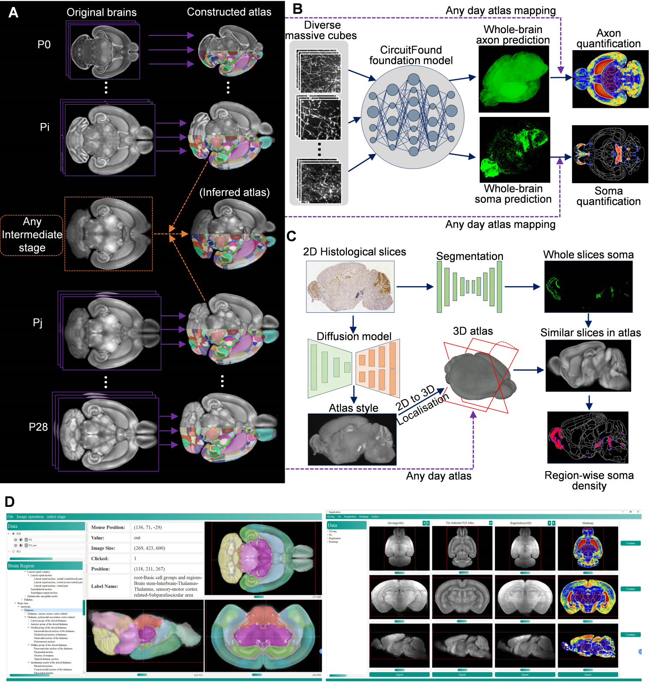

# D-LMBmapX

- [Paper](https://www.biorxiv.org/content/10.1101/2025.02.25.639766v1)
- [Software]()

## 🌟 Overview

D-LMBmapX, a deep learning–based framework designed for automated whole-brain circuitry profiling throughout postnatal development. It provides:

1. Sample-inferred atlas construction method from anchor stages.

2. Foundation model for generalized axon and soma segmentation.
3. Cross-modality and cross-dimensional registration method.
4. An open-source and user-friendly software.
5. Generalizable 5D biomedical spatial analysis strategies.

## 🎉 D-LMBmapX software

D-LMBmapX provides an open-source software featuring a user-friendly GUI. The software allow researchers to easily build customized applications and extend functionalities for neuroscience studies. The graphical interface enables selection, configuration, and execution of various deep learning models for registration, segmentation, facilitating efficient analysis for whole brain circuitry profiling.
